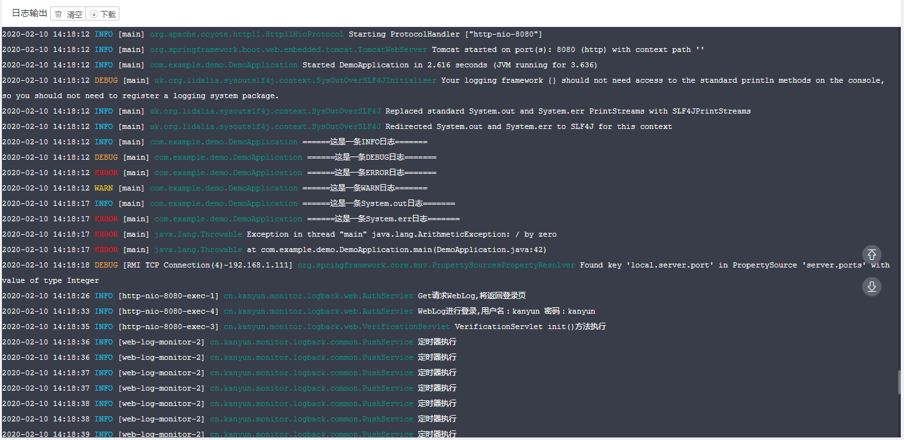

### WebLogMonitor

#### 1.功能描述
>**WebLogMonitor**是一款轻量的,几乎0侵入式的查看系统日志的插件,适用于java web,传统项目查看日志往往需要登录到服务器
找到对应的java进程,并查看日志,使用十分不便！使用该插件,可以在浏览器页面查看到实时的日志输出,大大减轻了调试的难度。
同时集成了简单的登录认证,限制IP访问的功能,保证了信息的安全,目前支持logback/log4j/log4j2,配合Slf4j服用效果更佳！

#### 2.适用场景
> 首先需要声明的是,这个插件并不是用来代替目前主流的日志系统,它存在的意义更多的是方便开发人员进行调试
>同时当你的硬件资源不够强大,或者人员紧缺的情况下,使用该插件可以减轻一定的工作量,从此你再也不为查看日志而手忙脚乱
。因此如果你的系统已经有了比较完善的日志系统,那么这款插件并不适合你,如果你的项目是传统的单体项目,或者你的硬件资源
不够丰富,但是你又有在线上查看实施日志的需求,那么恭喜你,相信这个日志插件能解决你的需求。


#### 3.如何获得
maven pom.xml 添加依赖

```xml
<dependency>
  <groupId>io.github.chenwuwen</groupId>
  <artifactId>web-log-monitor</artifactId>
  <version>1.0.0</version>
</dependency>

```
gradle build.gradle 添加依赖
```groovy
implementation group: 'io.github.chenwuwen', name: 'web-log-monitor', version: '1.0.0'
```

未使用包管理工具的自行[下载](https://github.com/chenwuwen/web-log-monitor/releases/download/v1.0.0/web-log-monitor-1.0.0-all.jar)全量包

#### 4.如何使用
添加依赖之后,可以通过在classpath 下创建web_log_monitor.properties文件(不是必须),[这里](https://github.com/chenwuwen/web_log_monitor/blob/master/web_log_monitor.properties)
可以在该配置文件中定义自己的配置

~~配置完成后,在logback的配置文件中的appender中添加一个filter
cn.kanyun.log.appender.WebLogLogBackFilter~~

```xml
    <appender name="STDOUT" class="ch.qos.logback.core.ConsoleAppender">
        <encoder class="ch.qos.logback.classic.encoder.PatternLayoutEncoder">
            <!--格式化输出：%d表示日期，%thread表示线程名，%-5level：级别从左显示5个字符宽度%msg：日志消息，%n是换行符-->
            <pattern>%d{yyyy-MM-dd HH:mm:ss.SSS} [%thread] %-5level %logger{50} - %msg%n</pattern>
        </encoder>
        <filter class="cn.kanyun.log.appender.WebLogLogBackFilter">
        </filter>
    </appender>
```

>LogBack配置
```xml
<configuration>

    <appender name="WebLogMonitor" class="cn.kanyun.log.appender.WebLogLogBackAppender">
    </appender>
    
    <root level="info">
        <appender-ref ref="WebLogMonitor"/>
    </root>
        
</configuration>
```

>Log4j2 配置

```xml

<configuration status="warn" monitorInterval="30" packages="cn.kanyun.log.appender">
        <!--先定义所有的appender-->
    <appenders>
         <!--这个就是自定义的Appender -->
        <WebLogLog4j2Appender name="WebLogAppender" appName="web_log_monitor"/>
    </appenders>
     <!--然后定义logger，只有定义了logger并引入的appender，appender才会生效-->
        <loggers>
           <root level="all">
               <appender-ref ref="WebLogAppender"/>
           </root>
        </loggers>
</configuration>

```

>Log4j配置

```properties

log4j.rootLogger=info,A1,R,WebLogLog4JAppender
# 注册 自定义的Log4jAppender
log4j.appender.WebLogLog4JAppender=cn.kanyun.log.appender.WebLogLog4JAppender
```


如果你的项目使用的Servlet版本低于3.0(通过web.xml查看),那么需要更换为Servlet3.0版本的头

```xml

<?xml version="1.0" encoding="UTF-8"?>  
   
<web-app  
        version="3.0"  
        xmlns="http://java.sun.com/xml/ns/javaee"  
        xmlns:xsi="http://www.w3.org/2001/XMLSchema-instance"  
        xsi:schemaLocation="http://java.sun.com/xml/ns/javaee http://java.sun.com/xml/ns/javaee/web-app_3_0.xsd">  
</web-app>

```

~~同时在web.xml的Filter 配置中添加异步支持~~

```xml
  <filter>
    <filter-name>CharacterEncodingFilter</filter-name>
    <filter-class>org.springframework.web.filter.CharacterEncodingFilter</filter-class>
    <async-supported>true</async-supported>
    <init-param>
      <param-name>encoding</param-name>
      <param-value>utf-8</param-value>
    </init-param>
  </filter>

```

这样就配置完成了。


> **注意:** 如果使用的是Springboot,那么还需要在启动类上添加一个@ServletComponentScan("cn.kanyun")注解。


配置完成之后,就可以启动项目了。

如果你使用的是Tomcat作为web容器,启动后抛出异常
```text
org.apache.tomcat.util.bcel.classfile.ClassFormatException:
Invalid byte tag in constant pool: 19
```

那么请升级你的Tomcat版本。


启动项目之后。通过输入地址:  项目地址/web/log

就可以打开WebLogMonitor的认证界面,输入用户名密码即可登录

> **默认** 用户名/密码：admin/admin

登录完成就可以查看到实时日志了





